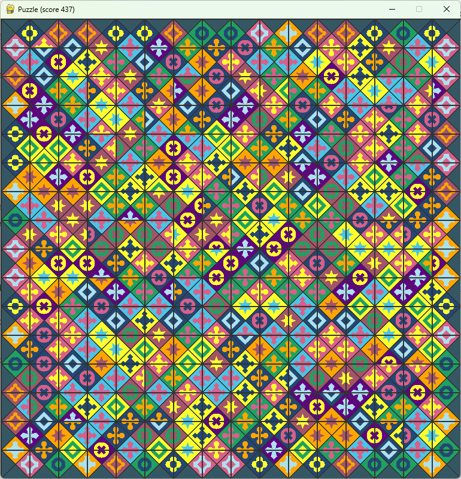
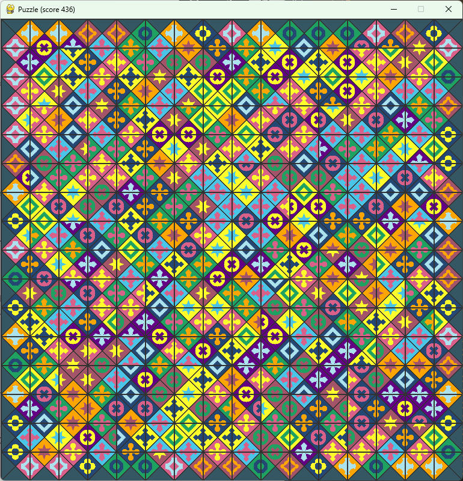

# Eternity II Puzzle Solver – Simulated Annealing Heuristique

## Description du puzzle

Eternity II est l'un des puzzles les plus difficiles jamais commercialisés. Sorti en 2007 avec un prix de 2 millions de dollars offert au premier qui le résoudrait complètement, il consiste à assembler 256 pièces uniques dans une grille 16x16 en faisant correspondre parfaitement les motifs (couleurs) sur tous les bords adjacents. Les bords extérieurs doivent être gris, et une pièce centrale spécifique est fixée en position et en orientation. Le concours s'est terminé en 2010 sans gagnant, et malgré les efforts de nombreux passionnés et informaticiens, le puzzle reste non résolu à ce jour (décembre 2025). Les meilleures solutions connues atteignent environ 469 correspondances internes parfaites sur 480 possibles (soit seulement 11 mismatches), un record obtenu autour de 2020 avec des algorithmes très sophistiqués.

## L'algorithme : le recuit simulé

Ce solveur repose sur le **recuit simulé** (Simulated Annealing), une métaheuristique d'optimisation inspirée du processus physique de recuit des métaux. L'idée est de simuler le comportement des atomes qui, lorsqu'on chauffe puis refroidit lentement un matériau, tendent à s'organiser dans une configuration d'énergie minimale (ici, on maximise le score de correspondances).

Le fonctionnement est le suivant : on part d'une disposition aléatoire des pièces (la pièce centrale restant fixée). À chaque étape, on propose un mouvement aléatoire – un échange de deux pièces – puis on optimise localement les rotations des pièces concernées pour maximiser les correspondances avec leurs voisins immédiats. On évalue alors le nouveau score global.

Au début, la "température" est élevée : même un mouvement qui dégrade le score a une chance non négligeable d'être accepté (probabilité donnée par exp(ΔS / T), où ΔS est la variation de score). Cela permet d'explorer largement l'espace des solutions et d'échapper aux optima locaux médiocres. Au fil du temps, la température diminue (multipliée à chaque étape par un facteur très proche de 1, ici 0.99995), rendant l'algorithme de plus en plus sélectif : il finit par n'accepter quasiment que les améliorations. Si le progrès stagne trop longtemps, un "boost" de température est appliqué pour relancer l'exploration et éviter de rester bloqué.

Cette approche est particulièrement adaptée à des problèmes comme Eternity II, où l'espace de recherche est astronomique et parsemé de nombreux pièges locaux.

## Implémentation et optimisations

Les parties les plus coûteuses (calcul du score global et optimisation locale des rotations) sont accélérées grâce à **Numba** (compilation JIT). L'exécution est parallélisée avec **multiprocessing** : plusieurs chaînes indépendantes (7 par défaut, facilement modifiable) tournent simultanément, chacune avec sa propre graine aléatoire, pour multiplier les chances de trouver de bonnes configurations. Un suivi en temps réel coloré dans la console affiche les progrès de chaque chaîne et le meilleur score global.

Les meilleures solutions sont sauvegardées automatiquement dans le dossier `soluce/` au format CSV compatible avec les viewers standards.

## Performances

Sur un matériel modeste, ce solveur atteint très rapidement des scores supérieurs à 330, et peut monter jusqu'à environ 337 avec des runs plus longs. Un exemple à 337 points est fourni dans `data/eternity2/best_eternity2_solution_2.csv`. C'est bien sûr loin des records mondiaux, mais suffisant pour obtenir rapidement de très belles configurations partielles et visuellement impressionnantes.



## Visualisation

Le solveur est conçu pour fonctionner avec le viewer interactif du repository [TheSil/edge_puzzle](https://github.com/TheSil/edge_puzzle), qui utilise les vraies images des pièces et permet même de jouer manuellement.

Pour afficher une solution générée :
```bash
python play.py -conf data/eternity2/eternity2_256_1.csv -hints soluces/best_eternity2_solution_X.csv
```
(Remplacez X par le numéro de seed de la solution souhaitée.)

## Prérequis et utilisation

- Python 3.8+
- `numpy`, `pandas`, `numba`
- Dataset : `data/eternity2/eternity2_256.csv`

Il suffit d'exécuter le script principal. Tous les paramètres importants (température initiale, nombre de chaînes, etc.) sont regroupés en haut du fichier pour une modification facile.

## Perspectives

Ce projet offre une implémentation propre, rapide et pédagogique du recuit simulé sur un problème réel emblématique. Il est parfait pour expérimenter ou obtenir de belles solutions partielles. Des améliorations sont possibles : placement prioritaire des pièces de bord, recherche tabou, croisements génétiques, etc. Contributions bienvenues !

Bonne chance dans votre quête de la solution parfaite… qui sait, une petite idée pourrait tout changer ! 🧩
